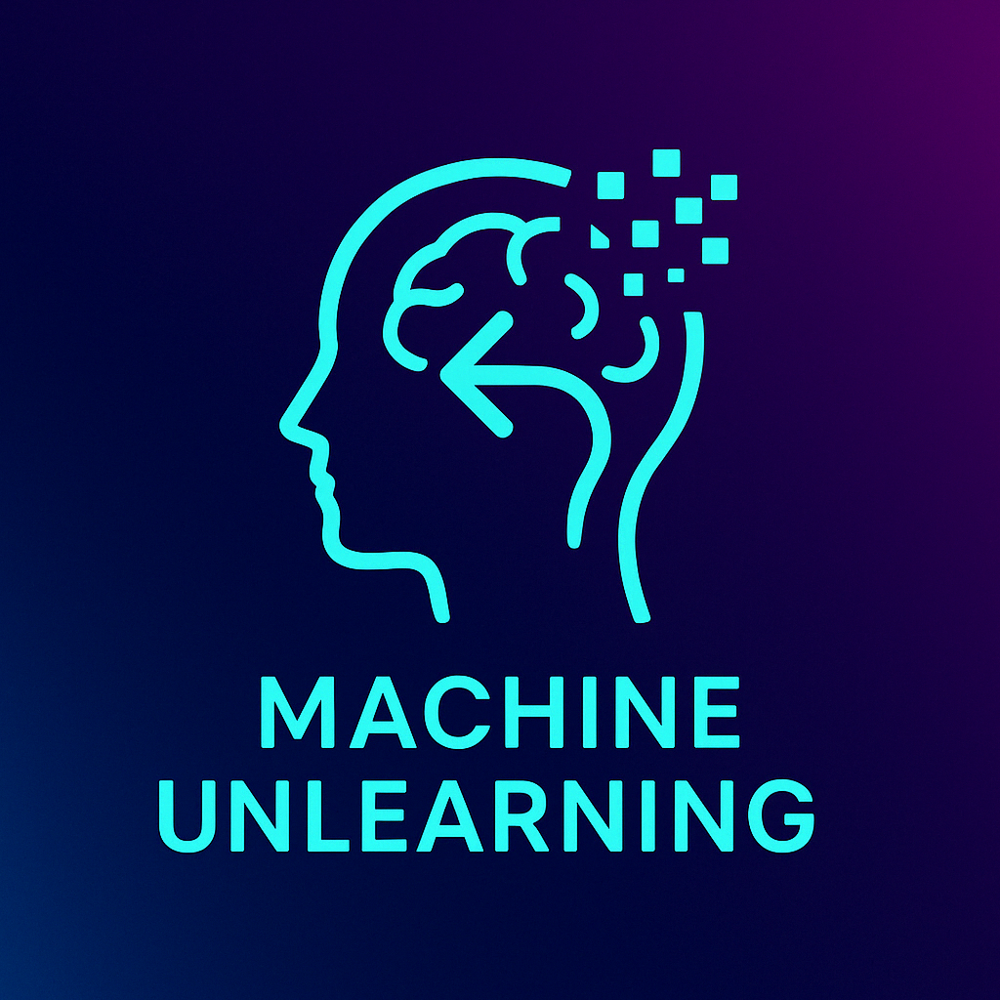
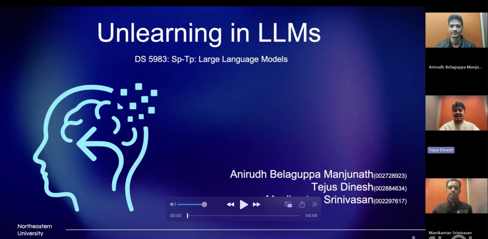

# Machine-Unlearning



**Intro**
Machine Unlearning is the process of removing data from a pre-trained model so as to stop it from giving out information related to the data. It can be used to remove biases, harmful content, etc. These techniques are being explored at large by many organisations to make LLMs safer, ethical and moral. We provide 3 different methods to perform unlearning or the illusion of Unlearning which include:

- Guardrailing: Technically not Unlearning but we use it as a baseline comparison. Guardrailing is the technique of using advanced system prompts and filters to make the model comply to the set standards about discussing certain things. This is not very efficient because of many reasons like requirement of a huge context window, Jailbreaking (a technique to surpass the filter using prompting techniques) and more.

- PEFT (LoRA) finetuning - We do a finetune on a dataset using a negative loss and gradient ascent to forget examples of harry potter and rather learn a masked representation of the same. This process uses a finetuning approach, not to learn new things but to unlearn old things. We show that this method works well by not answering questions related to harry potter but answer other questions coherently.

- Sparse autoencoders (SAEs) - The last technique is sparse autoencoders which can be hooked in different stages of the LLMs to find the most relevant activations related to the specific topic and then abate the concepts (or in other words supress the activations). This is a relatively new method with a lot of new research into it.


**Model**
We use the Meta's Llama3-8b-Instruct model for this task due to compute reasons mainly (and availability of pre-trained SAEs for the same which we can plug into the LLM).

Link: [Llama3-8b](https://huggingface.co/meta-llama/Meta-Llama-3-8B-Instruct)

**Dataset**
For the dataset we use the 7 harry potter books for the forget set from here: [hp books](https://www.kaggle.com/datasets/shubhammaindola/harry-potter-books) and combine all the books into 1 txt file.

For retain dataset we use wikitext (huggingface version) [Link](https://huggingface.co/datasets/Salesforce/wikitext/viewer/wikitext-103-v1)

**Files**

```SAE Unlearning Llama3 8b IT.ipynb``` - Contains The code for sparse autoencoder implementation of unlearning. <br>
```Unlearning Llama 3 8b IT.ipynb``` - Contains the code for PEFT LoRA finetuning for Unlearning.<br>
```Guardrailing_Llama3_8b_IT.ipynb``` - Contains the code for guardrailing Llama3-8b-Instruct using llama3 guard. <br>

```data/harry_potter_keywords.txt``` - Contains a big set of words that we use as context to forget in SAE, LoRA and Guardrailing.<br>
```data/harry_potter_dataset.txt``` - Contains all the 7 books of Harry Potter used for PEFT finetuning for forget dataset.<br>
```data/hp_perp``` - Contains 1000 samples for computing perplexity on Harry Potter data.<br>
```data/wiki2_perp``` - Contains wikitext data for computing perplexity for Non-Harry Potter data.<br>

**presentation**

[](https://youtu.be/TJTNndfGlSM)

**Conclusion**

We conclude that PEFT is the best method in our comparison given our constraints, to forget sensitive data. It gives blank lines for questions revolving around Harry Potter and answers the other questions well. SAE is a more interpretable method and is a new area of research and has a lot of promise, but for our relatively smaller model size, it does sometimes give out information about the HP universe (though it mostly gets ablated). Guardrailing is a good idea and is technically not unlearning but is easily breakable using jailbreaking and is not fail safe and also uses extra context tokens (due to system prompting).
